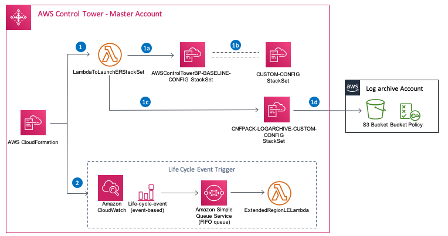
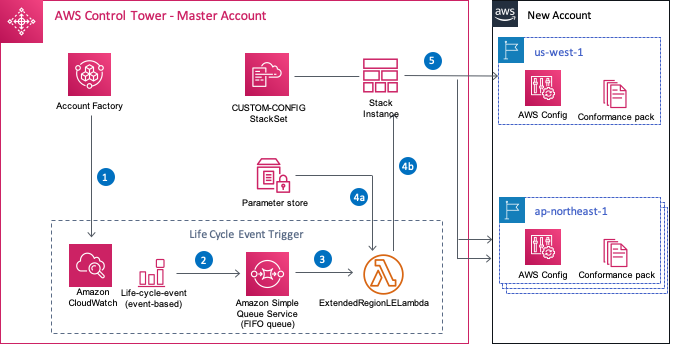

## Extend AWS Control Tower governance using AWS Config Conformance Packs

AWS Control Tower leverages [AWS Config](https://aws.amazon.com/config/)
to implement [detective
guardrails](https://docs.aws.amazon.com/controltower/latest/userguide/guardrails.html).
AWS Config is enabled in regions where Control Tower is available, with
configuration history and snapshots delivered to an Amazon S3 Bucket
located in a centralized Log Archive account. Customers using AWS
Control Tower want to enable additional detective guardrails and
additional config rules in those region(s) and others. In this post, we
will call the regions where AWS Control Tower is available "Control
Tower regions" with the rest being called "other regions".\
\
AWS Config [Conformance
Packs](https://docs.aws.amazon.com/config/latest/developerguide/conformance-packs.html)
enable you to create packages of compliance rules, simplifying
deployment at scale by packaging up both rules and remediation actions
into a single entity. Conformance Packs rely on AWS Config recording
being enabled in a region as compliance is reported based on tracking of
resources and changes to them.\
\
Customers can start deploying AWS Control Tower in one of its regions
and enable the baselines and guardrails included within the service.
Independently, they can then enable multiple additional AWS Config
Conformance Packs, on Control Tower regions, other regions or both. With
this approach, customers can take advantage of the well-architected
landing zone, best-practices blueprints, and enable governance using
guardrails that come with AWS Control Tower and others available from
AWS. Additionally, customers have asked for guidance on how to enable
guardrails on remaining regions and have the ability to move those to
AWS Control Tower natively with minimal efforts when a new Control Tower
region is launched.\
\
AWS Control Tower uses [AWS CloudFormation
StackSets](https://docs.aws.amazon.com/AWSCloudFormation/latest/UserGuide/what-is-cfnstacksets.html)
to create resources like Config, [Config
Aggregator](https://docs.aws.amazon.com/config/latest/developerguide/aggregate-data.html),
[AWS CloudTrail](https://aws.amazon.com/cloudtrail/) and [centralized
logging](https://docs.aws.amazon.com/controltower/latest/userguide/logging-and-monitoring.html).
In this post, we leverage the same mechanism to enable AWS Config in
other regions. Then we follow the instructions outlined in the [Deploy
AWS Config Rules and Conformance Packs using a delegated
admin](https://aws.amazon.com/blogs/mt/deploy-aws-config-rules-and-conformance-packs-using-a-delegated-admin/)
post to enable guardrails across the organization.

There are two key advantages following the guidance provided in this
post:

1.  There is no need to move the history of your Config data between
    buckets when AWS Control Tower launches a new region. You will
    continue to maintain the AWS Config history in the same S3 bucket
    created by AWS Control Tower.

2.  You can continue to use the Config Aggregator setup by AWS Control
    Tower to visualize and audit your entire environment from a single
    location.

Background
----------

Here's a quick review of some of the terms used in this post:

-   An AWS Account Factory account is an AWS account provisioned using
    [Account
    Factory](https://docs.aws.amazon.com/controltower/latest/userguide/account-factory.html)
    in AWS Control Tower.

-   AWS Control Tower home region is the AWS region where your AWS
    Control Tower was deployed.

-   [AWS Service Catalog](https://aws.amazon.com/servicecatalog) allows
    you to centrally manage commonly deployed IT services. In the
    context of this blog, Account Factory uses AWS Service Catalog to
    provision new AWS accounts.

-   [AWS Organizations](https://aws.amazon.com/organizations/) helps you
    centrally govern your environment as you grow and scale your
    workloads on AWS.

-   AWS [CloudFormation
    StackSets](https://docs.aws.amazon.com/AWSCloudFormation/latest/UserGuide/stacksets-concepts.html)
    extends the functionality of stacks by enabling you to create,
    update, or delete stacks across multiple accounts and regions with a
    single operation

-   A [stack
    instance](https://docs.aws.amazon.com/AWSCloudFormation/latest/UserGuide/stacksets-concepts.html#stacksets-concepts-stackinstances)
    is a reference to a stack in a target account within a Region.

-   A stack is a collection of AWS resources that you can manage as a
    single unit.

-   An
    [aggregator](https://docs.aws.amazon.com/config/latest/developerguide/aggregate-data.html)
    is an AWS Config resource type that collects AWS Config
    configuration and compliance data from multiple account/regions with
    in the organization.

-   A [conformance
    pack](https://docs.aws.amazon.com/config/latest/developerguide/conformance-packs.html)
    is a collection of AWS Config rules and remediation actions that can
    be easily deployed as a single entity in an account and a Region or
    across an organization in AWS Organizations.

-   [AWS Systems Manager Parameter
    Store](https://docs.aws.amazon.com/systems-manager/latest/userguide/systems-manager-parameter-store.html)
    provides secure, hierarchical storage for configuration data
    management and secrets management.

Things to consider
------------------

Below are some of the exceptions that are essential to understand before
we dive deep in to the solution:

-   As part of this post, you will deploy Stack instances in additional
    regions and orchestrate this through a custom StackSet. When AWS
    Control Tower supports a new region, customers are notified to
    update the AWS Control Tower.

-   Before you update the AWS Control Tower, you need to delete the
    stack instances for these newly supported region with in the custom
    StackSet. Required steps are mentioned below. If you fail to delete
    the stack instances before upgrading AWS Control Tower, the upgrade
    process could fail.

-   In the time period during which you delete the Stack instances and
    upgrade AWS Control Tower, the traceability of any changes during
    that period will not be captured. It is recommended to perform the
    deletion of stack instances and upgrading at time window where
    minimum changes to your resource configuration are expected.

-   Once the AWS Control Tower Landing Zone is upgraded successfully,
    you will have the continuity of the AWS Config data which is
    collected in the centralized log archive account.

-   CloudFormation StackSets are yet to be supported in few regions such
    as eu-south-1, me-south-1 and af-south-1. You will not be able to
    use this solution for those regions using the steps provided in the
    post. For latest information on supported regions for AWS
    CloudFormation StackSets, refer to [Global infrastructure Region
    table](https://aws.amazon.com/about-aws/global-infrastructure/regional-product-services/).

Solution Overview
-----------------

The following diagram illustrate the steps involved in enabling AWS
Config and detective guardrails in the regions that AWS Control Tower is
not supported yet.

You need to deploy the
[CloudFormation stack ](https://docs.aws.amazon.com/AWSCloudFormation/latest/UserGuide/stacks.html)in
AWS Control Tower home region. When you deploy the CloudFormation stack
which is provided as part of this blog, it deploys following:

1.  Creates a Lambda function:

    a.  queries the existing AWSControlTowerBP-BASELINE-CONFIG StackSet
        for template body and parameters that AWS Control Tower uses to
        configure AWS Config on the regions that AWS Control tower is
        supported on.

    b.  stores the list of regions RegionsToDeploy in Parameter Store.

    c.  creates a new StackSet in the master account with template body
        and parameters derived from step 1a. This new StackSet will be
        used to deploy AWS Config resources across other regions.

    d.  if SetupConformancePack is selected while deploying the stack,
        an additional stackset will be deployed in the log archive
        account to configure the S3 bucket that is [required for
        conformance
        packs](https://docs.aws.amazon.com/config/latest/developerguide/cpack-prerequisites.html#cpack-prerequisites-organizationcpack).

    e.  creates an S3 bucket and applies bucket policy to enable
        GetObject and PutObject access to all accounts with in the
        organization.

2.  Setup the Life Cycle Event trigger to automatically enable Config
    when new accounts are created using Account Factory.

{width="5.853210848643919in"
height="3.064219160104987in"}

When a new account is created using Account Factory:

1.  AWS Control Tower generates a CreateManagedAccount life cycle event.

2.  when this event is generated, CloudWatch rule adds the event to
    Amazon SQS queue.

3.  SQS queue triggers a Lambda function in the order it received.

4.  Lambda function process the event for account-id and:

    a.  get regions list for SSM Parameter Store

    b.  add a stack instance to the existing StackSet.

5.  {width="5.668055555555555in"
    height="2.8930555555555557in"}Enable AWS Config and adds the
    selected regions to Config Aggregator in the Audit account.

You further follow the steps provided in this blog to enable delegated
admin access to the Config Aggregator and enable the conformance pack
across the organization.

Prerequisites
-------------

-   In case AWS Config was ever enabled in the other regions, a default
    Configuration Recorder and Delivery channel are created. These needs
    to be removed from the account/region to which you are going to
    extend governance. Check [Failure Error that Mentions AWS
    Config](https://docs.aws.amazon.com/controltower/latest/userguide/troubleshooting.html#aws-config-error) for
    steps to achieve this.

-   Use the latest [aws-cli](https://github.com/aws/aws-cli) version.

How it works:
-------------

### Step-1: Launch Config baseline stacks across account/region(s)

We launch a stack that creates new StackSet to enable AWS Config, add to
Config Aggregator and configure centralized logging in the regions that
AWS Control Tower is other regions. In addition, it optionally creates
an S3 bucket in the Log Archive account which is a prerequisite for
conformance pack.

-   Log in to the Control Tower Master account, switch to your AWS
    Control Tower home region.

-   Click on [Launch
    stack](https://console.aws.amazon.com/cloudformation#/stacks/new?stackName=ExtendedRegionStack&templateURL=https://vinjak-outbox.s3.us-east-2.amazonaws.com/ExtendedRegionSupport.yaml) 

-   Choose **Next**

-   Fill in the parameters:

    -   AWS Config Parameters

        -   DeployTo: 

            -   Existing Only: Enable Config only on the new accounts.
                No Lifecycle Event triggers will be set up.

            -   Future Only: Do not Enable Config on existing account.
                Set up Lifecycle Event triggers only

            -   Both (**default**): Enables Config on both existing
                accounts and set up Lifecycle Event triggers.

        -   NewStackSetName: StackSet Name to be used for the new
            StackSet. **Default:** CUSTOM-CONFIG-STACKSET

        -   RegionsToDeploy:

            -   Comma separated region list. **Default:**
                "us-west-1,ap-northeast-1"

    -   Conformance Pack Parameters:

        -   SetupConformancePack: Do you want set up infrastructure
            required for Conformance Packs, Yes (**default**) or no.

        -   SSEAlgorithm: S3 encryption to be used, AES256 (**default**)
            or aws:kms.

        -   KMSMasterKeyID: If using KMS encryption, the Key ID to be
            used.

        -   LogArchiveAccountId: Account ID to be used for the
            Conformance Pack S3 Bucket. On Control Tower master account
            copy & paster below URL and choose **Log archive account**
            to get the account id.

            -   URL: <https://console.aws.amazon.com/controltower/home/sharedresources/logarchive>

For this walk through, type in your Control Tower Log Archive Account ID
in LogArchiveAccountId and leave defaults for the other parameters.

-   Choose **Next, Next**

-   Checkbox **I acknowledge that AWS CloudFormation might create IAM
    resources** and **Create stack**

-   Wait until the Stack status changes to CREATE_COMPLETE

Note: Check the Status of the Stack instances (should be CURRENT) in the
CloudFormation StackSet name you provided in NewStackSetName above.

### Step-2: Check for AWS Config and Config Aggregator status

Now that we enabled AWS Config in the additional regions and added to
Config Aggregator. Let us validate that the Config status is properly
reported on the Config Aggregator. Sometimes it could take over 30
minutes for all these regions to renegotiate the source status. Below
aws-cli command allows you to view the overall status for various
accounts and regions .

-   Access the [Audit Account using the AWS
    CLI](https://aws.amazon.com/blogs/security/aws-single-sign-on-now-enables-command-line-interface-access-for-aws-accounts-using-corporate-credentials/)

-   Check if Config Aggregator successfully negotiated with the regions
    in which the stack instances are deployed. For this blog example:
    us-west-1, ap-northeast-1:

\$ export CTHOME=\'\<Your-CT-HOME-REGION\>\' 

\$ aws configservice describe-configuration-aggregator-sources-status
\--configuration-aggregator-name
aws-controltower-GuardrailsComplianceAggregator \--region \$CTHOME
\--query \'AggregatedSourceStatusList\[?AwsRegion==\`us-west-1\` \|\|
AwsRegion==\`ap-northeast-1\`\].{SID:SourceId,Region:AwsRegion,Status:LastUpdateStatus,MSG:LastErrorMessage}\'
\--output table 

\-\-\-\-\-\-\-\-\-\-\-\-\-\-\-\-\-\-\-\-\-\-\-\-\-\-\-\-\-\-\-\-\-\-\-\-\-\-\-\-\-\-\-\-\-\-\-\-\-\-\-\-\-\-\-\--\
\|     DescribeConfigurationAggregatorSourcesStatus      \|\
+\-\-\-\-\--+\-\-\-\-\-\-\-\-\-\-\-\-\-\-\-\-\--+\-\-\-\-\-\-\-\-\-\-\-\-\-\-\--+\-\-\-\-\-\-\-\-\-\-\--+\
\|  MSG \|     Region       \|      SID       \|  Status    \|\
+\-\-\-\-\--+\-\-\-\-\-\-\-\-\-\-\-\-\-\-\-\-\--+\-\-\-\-\-\-\-\-\-\-\-\-\-\-\--+\-\-\-\-\-\-\-\-\-\-\--+\
\|  None\|  ap-northeast-1  \|  965183582051  \|  SUCCEEDED \|\
\|  None\|  us-west-1       \|  300540541484  \|  SUCCEEDED \|\
\|  None\|  ap-northeast-1  \|  408161965614  \|  SUCCEEDED \|\
\|  None\|  us-west-1       \|  965183582051  \|  SUCCEEDED \|\
\|  None\|  us-west-1       \|  737250105869  \|  SUCCEEDED \|\
\|  None\|  ap-northeast-1  \|  959378824637  \|  SUCCEEDED \|\
\|  None\|  ap-northeast-1  \|  300540541484  \|  SUCCEEDED \|\
\|  None\|  ap-northeast-1  \|  737250105869  \|  SUCCEEDED \|\
\|  None\|  us-west-1       \|  408161965614  \|  SUCCEEDED \|\
\|  None\|  us-west-1       \|  959378824637  \|  SUCCEEDED \|\
+\-\-\-\-\--+\-\-\-\-\-\-\-\-\-\-\-\-\-\-\-\-\--+\-\-\-\-\-\-\-\-\-\-\-\-\-\-\--+\-\-\-\-\-\-\-\-\-\-\--+

-   Wait for all regions to transition to a SUCCEEDED state and check in
    the AWS Config Aggregator for resources and any non-compliances on
    these accounts/regions. This could take 15-20 minutes on an
    average. 

-   Click
    [here](http://console.aws.amazon.com/config#/aggregate-dashboard/aws-controltower-GuardrailsComplianceAggregator/us-west-1/)
    to view any non-compliances accounts or resources using AWS Config
    Console on the Audit account.

### Step-3: Deploy AWS Control Tower Detective Guardrails using Config Conformance Pack

You can enable the AWS Control Tower detective guardrails across all
accounts by deploying the [AWS Control Tower Detective Guardrails
Conformance
Pack](https://docs.aws.amazon.com/config/latest/developerguide/aws-control-tower-detective-guardrails.html).
 Deploy the conformance pack using one of two methods: 1. by launching
the conformance pack on individual account, 2. Enable conformance pack
at the organization level. 

We will use option \#2 in this post. This option gives you ability to
enable guardrails and config rules across all your accounts with in the
organization by executing a single command. You could also exclude
enabling guardrails on few accounts from your organization  if needed.

Follow the instructions detailed in [Deploy AWS Config Rules and
Conformance Packs using a delegated
admin](https://aws.amazon.com/blogs/mt/deploy-aws-config-rules-and-conformance-packs-using-a-delegated-admin/),
relevant steps are listed below:

-   Run this command from the master account (update aws-cli to latest
    version if you haven't yet done so)

aws organizations enable-aws-service-access
\--service-principal=config-multiaccountsetup.amazonaws.com

-   To check the status, run the following command and check
    for \"ServicePrincipal\":
    \"config-multiaccountsetup.amazonaws.com\" under
    "EnabledServicePrincipals"

aws organizations list-aws-service-access-for-organization

-   Register a delegated administrator account. Replace the
    {Audit-Account-ID} with your audit account id.

aws organizations register-delegated-administrator
\--service-principal=config-multiaccountsetup.amazonaws.com
\--account-id=\"{Audit-Account-ID}\"

-   To check status of delegated administrators. Check for Id and Status
    sections of the output of below command.

aws organizations list-delegated-administrators

-   [Download](https://docs.aws.amazon.com/config/latest/developerguide/aws-control-tower-detective-guardrails.html)
    the AWS Control Tower Guardrails conformance pack to your local
    machine. You need it while deploying the conformance pack

-   If you have selected SetupConformancePack: Yes while deploying stack
    in step-1, an S3 Bucket is created in the Log archive account.  If
    you already have an S3 Bucket in central location that you could
    reuse for conformance packs, you could select No.

-   If you created S3 Bucket by selecting SetupConformancePack: Yes .
    You could note down the S3 Bucket name from the output section of
    CloudFormation stack.

    -   Log in to Log archive account

    -   Look for CloudFormation Stack name that starts
        with StackSet-CNFPACK-LOGARCHIVE-CUSTOM-CONFIG-STACKSET 

    -   Choose output section and note down the S3 bucket name

-   If you selected SetupConformancePack: No while deploying stack in
    step-1, identify and note down the S3 bucket that you want to use
    while deploying the conformance-pack.

-   Deploy the conformance pack across all regions you subscribed to
    (us-west-1 and ap-northeast-1 in this example) and enabled AWS
    Config recorder. Replace the awsconfigconforms-your-bucket and
     your-region values that are applicable to your environment.

aws configservice put-organization-conformance-pack
\--organization-conformance-pack-name=\"CT-Conformance-Pack\"
\--template-body=\"file://CTConformancePack.yaml\"
\--delivery-s3-bucket=\"{awsconfigconforms-your-bucket}\" \--region
\<your-region\>

**Note:** You could use \--excluded-accounts option to exclude list of
AWS accounts to be excluded from an organization conformance pack while
deploying a conformance pack.

-   Run below command to check the status of the conformance pack across
    multiple accounts. It may take up to 5 minutes to reflect the status
    in command output.

aws configservice get-organization-conformance-pack-detailed-status
\--organization-conformance-pack-name CT-Conformance-Pack \--region
\<your-region\>

-   Repeat the above
    put-organization-conformance-pack/get-organization-conformance pack
    commands on remaining regions to enable in deploy conformance pack
    on other regions.

On completion of the section, you will be able to see any non-compliant
resources on these regions in the Config Aggregator console in the Audit
account. You can access the console using below link in your Audit
account:
http://console.aws.amazon.com/config\#/aggregate-dashboard/aws-controltower-GuardrailsComplianceAggregator/\<ct-home-region\>/. 

Note that the non-compliance resources from these additional regions you
added using this post will not be reported on the AWS Control Tower
Dashboard.

### Step-4: Upgrade steps when a new region support is added to AWS Control Tower

Let us say, AWS Control Tower added support to new region (example:
us-west-1). You need to perform the below actions before you start
upgrading your AWS Control Tower to enable new region:

-   Log in to Master Account

-   Look for the StackSet with name NewStackSetName that you provided in
    step 1.

-   Under stack instances identify list of accounts that has deployments
    in the new AWS region supported. Here we use us-west-1.

-   Follow the [steps to delete the stack
    instances](https://docs.aws.amazon.com/AWSCloudFormation/latest/UserGuide/stackinstances-delete.html) from
    us-west-1

-   Delete the newly supported region from the Parameter store
    (<https://console.aws.amazon.com/systems-manager/parameters/CFN-RegionsToDeployParam-xxxxxxxxxxx>)
    to avoid creation of stacks on the new region for accounts you
    create in the future.

-   Delete the conformance pack on the new region to avoid additional
    charges. Replace us-west-1 with new region as needed and run below
    command.

aws configservice delete-organization-conformance-pack
\--organization-conformance-pack-name \"CT-Conformance-Pack\" \--region
us-west-1

-   [Update the Landing
    Zone](https://docs.aws.amazon.com/controltower/latest/userguide/configuration-updates.html#update-controltower).
    The new region stacks will get added to the
    [AWSControlTowerBP-BASELINE-CONFIG](https://console.aws.amazon.com/cloudformation#/stacksets/AWSControlTowerBP-BASELINE-CONFIG/stacks) StackSet. 

-   **Optional !!** For testing, delete few Stack instances from
    NewStackSetName and Add them back. You should be able to see AWS
    Config disabled when Stack instances are deleted and enabled back
    without an issue once created back.

### Step-5 (Optional): Deploy Additional Guardrails using Config Conformance Packs

As in the previous step, you can further extend your governance by
deploying additional [Conformance
Packs](https://docs.aws.amazon.com/config/latest/developerguide/conformancepack-sample-templates.html)
such as [Operational Best Practices for NIST
CSF](https://docs.aws.amazon.com/config/latest/developerguide/operational-best-practices-for-nist_csf.html)
or any of the other available ones. We will continue to use the method
from step 3, enabling the conformance pack at the organization level. 

All that is required is to download the relevant pack you wish to deploy
and run the following command, updating the path to where you saved the
template:

aws configservice put-organization-conformance-pack
\--organization-conformance-pack-name=\"NIST-CSF-Conformance-Pack\"
\--template-body=\"file://NISTCSFConformancePack.yaml\"
\--delivery-s3-bucket=\"{awsconfigconforms-your-bucket}\" \--region
\<your-region\>

**Note:** please read the points highlighted on the previous steps
carefully to make sure you understand the options.

To check for the status of the newly deployed pack, run the below
command. It may take up to 5 minutes to reflect the status in command
output.

aws configservice get-organization-conformance-pack-detailed-status
\--organization-conformance-pack-name
NIST-CSF-Conformance-Pack \--region \<your-region\>

Repeat the above process on any remaining regions and/or for any
additional packs you wish to apply to your environment.

As previously, you will be able to see any non-compliant resources on
these regions in the Config Aggregator console in the Audit account. You
can access the console using below link in your Audit account:
http://console.aws.amazon.com/config\#/aggregate-dashboard/aws-controltower-GuardrailsComplianceAggregator/\<ct-home-region\>/. 

Cleanup
-------

If you are experimenting and want to clean this up after testing or
decide not to go with this approach, follow the steps below to cleanup
the solution that you set up in this blog:

-   Delete the stack instances from the StackSet NewStackSetName that
    you created in Step 1

-   After removing all stack instances, [delete the
    StackSet](https://docs.aws.amazon.com/AWSCloudFormation/latest/UserGuide/stacksets-delete.html)

-   If you have selected SetupConformancePack: Yes ,  you will need to
    delete the stack instances and StackSet
    CNFPACK-LOGARCHIVE-CUSTOM-CONFIG-STACKSET. The S3 Bucket is created
    in the LogArchive account. This bucket is not deleted when you
    delete the StackSet. Delete it manually if needed.

-   Run below command  on you master account to delete the conformance
    pack that you deployed at organization level in Step 3

aws configservice delete-organization-conformance-pack
\--organization-conformance-pack-name \"CT-Conformance-Pack\" \--region
us-west-2

-   Change the region name and repeat the above command to delete
    organization conformance pack on multiple regions if needed.

-   To deregister the delegated admin run this command from the master
    account:

aws organizations deregister-delegated-administrator
\--account-id=\"{Audit-Account-ID}\" \--service-principal=config-multiaccountsetup.amazonaws.com

## Security

See [CONTRIBUTING](CONTRIBUTING.md#security-issue-notifications) for more information.

## License

This library is licensed under the MIT-0 License. See the LICENSE file.

